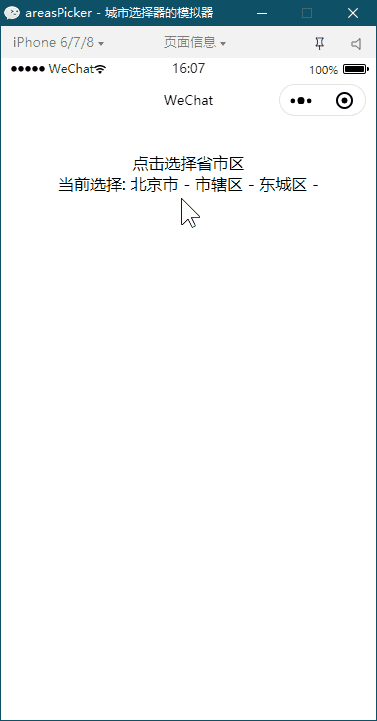

# 微信小程序 省市区组件-点选模式

## 说明

省市区组件-点选模式

> areas-value初始值: 格式[{name: '省', id: ''},{name: '市', id: ''},{name: '区', id: ''},{name: '镇', id: ''}]

> show-areas末项ID: 为 true 时显示，默认隐藏

> areas-level层级：默认3，可选 1省、2省市、3省市区(默认)、4省市区镇（根据数据需求展示）

> bind:Callback选择后回调: 回调内容为 success 时成功，为 fail 时失败

**注意：**
中华人民共和国行政区划数据来源于 [Administrative-divisions-of-China](https://github.com/modood/Administrative-divisions-of-China)

## 示例

导入组件
```json
{
  "usingComponents": {
    "areasPicker": "/components/areasPicker/areasPicker"
  }
}
```
页面放置组件
```html
<areasPicker
  areas-value="{{areasValue}}"
  show-areas="{{showAreas}}"
  areas-level="3"
  bind:Callback="callAreas">
</areasPicker>
```
控制组件显示
```js
this.setData({
  showAreas: true
});
```

## 后语

### 欢迎 Star ，后续将有更多不同的组件分享。
#### 更多了解请下载组件测试了解。
#### 演示代码片段：[https://developers.weixin.qq.com/s/NqFYLTmq7tgV](https://developers.weixin.qq.com/s/NqFYLTmq7tgV)

## 预览

### 省市区


## 动态预览


